# Customer Churn Prediction - Production Django Dashboard

An end-to-end Machine Learning & Web Production System built with **Django 5**, **MLflow**, and **Scikit-Learn** that predicts telecom customer churn in real time and provides an executive intelligence dashboard with automated retraining and an extended EDA notebook study.

---

## Application Screenshots (Captured from Live Web Dashboard)

### 1. Executive Churn Dashboard (`/`)
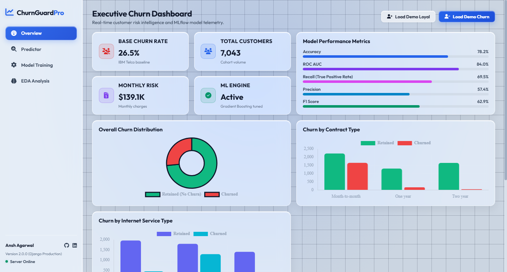

### 2. Customer Churn Predictor (`/predict`)
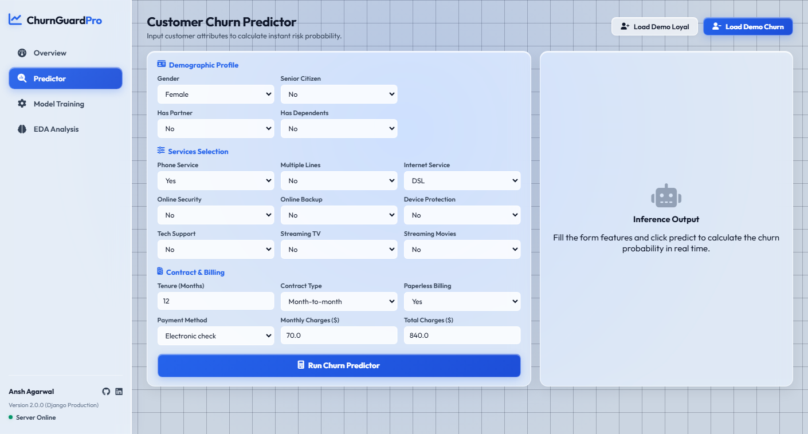

### 3. MLflow Model Retraining & SSE Log Streaming (`/train`)
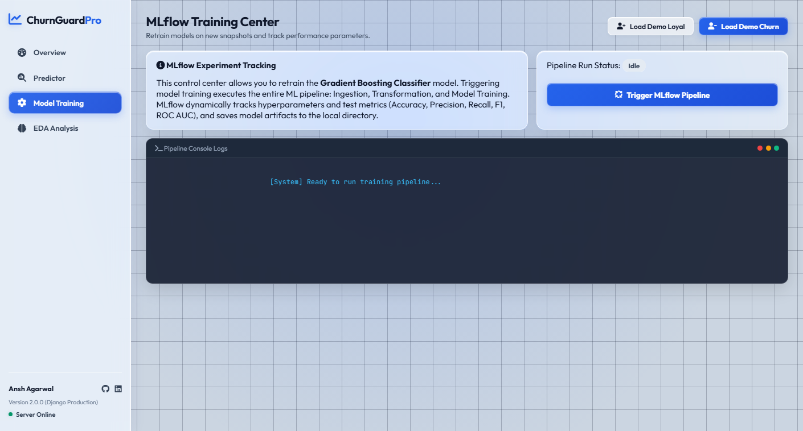

### 4. Extended Exploratory Data Analysis & Feature Exploration (`/eda`)
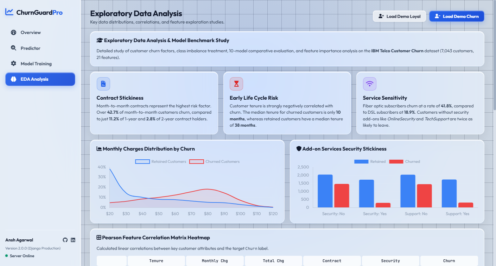

---

## Extended Exploratory Data Analysis & Notebook Charts

Extracted directly from [`notebook/churn_prediction.ipynb`](notebook/churn_prediction.ipynb):

| Chart 1: Churn Class Distribution | Chart 2: Churn by Contract Type |
| :---: | :---: |
| 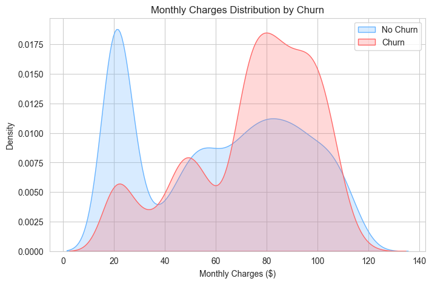 | 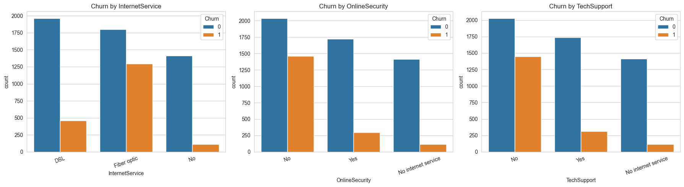 |

| Chart 3: Tenure Cohort Distribution | Chart 4: Monthly Charges vs Churn |
| :---: | :---: |
| 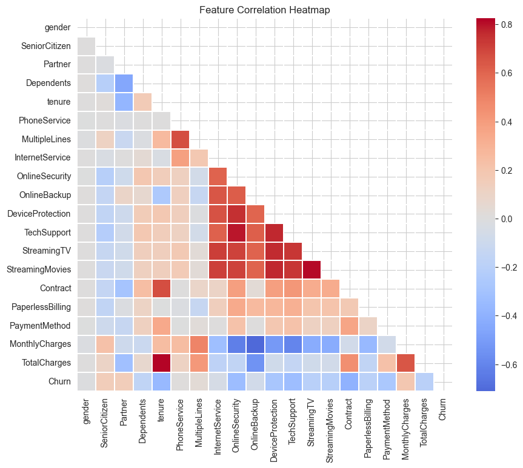 | 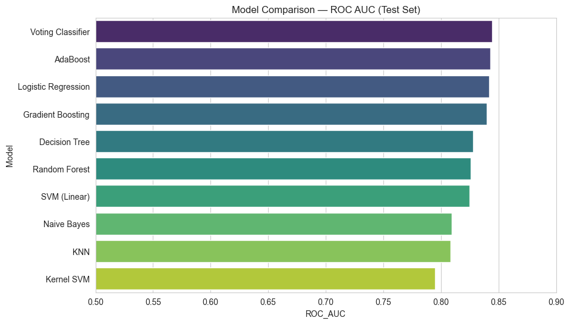 |

| Chart 5: Internet Service Churn | Chart 6: 10-Model Benchmark |
| :---: | :---: |
| 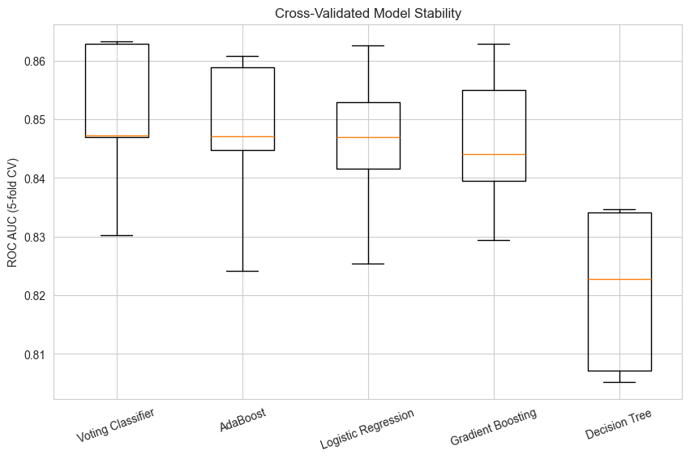 | 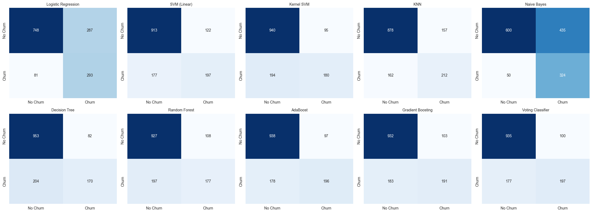 |

| Chart 7: Effect of SMOTE | Chart 8: Top Churn Drivers |
| :---: | :---: |
| 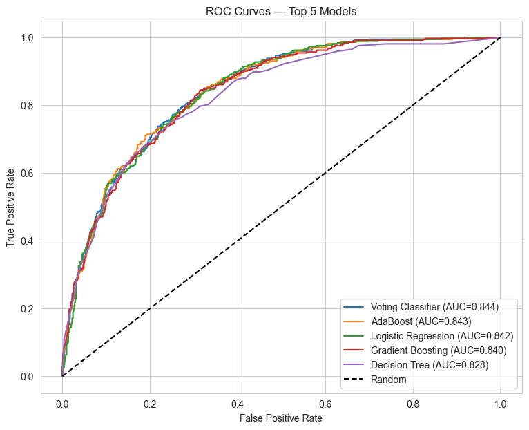 | 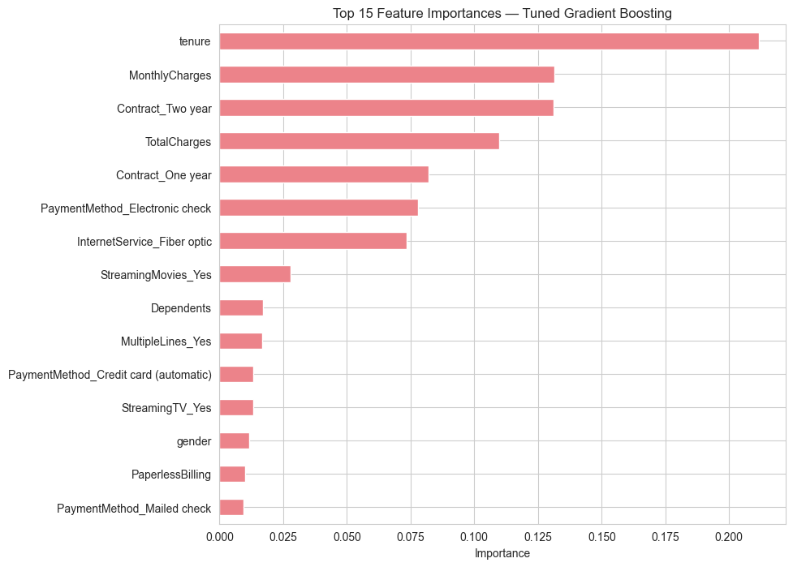 |

---

## Executive Summary

- **Frosted Glassmorphism Executive Dashboard**: Built with Django 5, featuring semi-transparent frosted acrylic surfaces (`backdrop-filter: blur(18px) saturate(190%)`), inset glass highlights, flat 2D vector grid canvas, and real-time risk scoring.
- **Extended EDA Analysis & Correlation Matrix**: Features a Pearson feature correlation heatmap matrix, 10-model benchmark comparison table, SMOTE oversampling treatment matrix, and service security stickiness analytics.
- **Instant Risk Predictor**: Form-driven REST API (`/predict`) providing instant single-customer churn risk scoring and circular SVG risk-meter visualization.
- **Live Retraining & SSE Telemetry**: Trigger model retraining directly from the UI (`/train`) with real-time console log streaming via Server-Sent Events (`/train/stream`).
- **Embedded Jupyter Notebook Study**: Dynamically converts and renders the project's exploratory data analysis and model comparison notebook (`notebook/churn_prediction.ipynb`) into HTML (`/notebook`).
- **ML Model Performance**: Evaluated 10 classification algorithms; tuned **Gradient Boosting Classifier** with **SMOTE** oversampling to achieve high recall on churners while maintaining **ROC AUC ≈ 0.84**.

---

## Architecture & Project Structure

```
customer-churn-prediction/
├── manage.py                   # Django CLI management utility
├── Procfile                    # Production Gunicorn entrypoint
├── render.yaml                 # Render 1-click cloud deployment blueprint
├── requirements.txt            # Python dependencies (Django, MLflow, Scikit-Learn, WhiteNoise)
├── README.md                   # Project documentation
│
├── churn_project/              # Core Django Project Configuration
│   ├── __init__.py
│   ├── settings.py             # Django settings (WhiteNoise, env vars, static files)
│   ├── urls.py                 # Root URL dispatcher
│   ├── wsgi.py                 # WSGI entrypoint for production
│   └── asgi.py                 # ASGI entrypoint
│
├── churn_app/                  # Django Web Application
│   ├── __init__.py
│   ├── apps.py                 # App configuration
│   ├── views.py                # Views for /, /predict, /metrics, /train, /train/stream, /notebook
│   └── urls.py                 # App URL route definitions
│
├── templates/
│   └── index.html              # Bento-Grid executive dashboard template
│
├── static/
│   ├── style.css               # Frosted Glassmorphism design system & CSS theme
│   ├── script.js               # Dynamic charts, SSE stream reader, and correlation heatmap logic
│   └── assets/                 # Captured web application screenshots & notebook charts
│
├── data/
│   └── Telco-Customer-Churn.csv# IBM Telco Customer Churn dataset (7,043 rows, 21 columns)
│
├── models/
│   ├── churn_model.pkl         # Final tuned Gradient Boosting model weights
│   ├── scaler.pkl             # StandardScaler fit on training data
│   ├── model_columns.pkl      # Training feature column order
│   ├── metrics.json           # Model validation metrics
│   └── feature_importance.json# Extracted feature importance values
│
└── notebook/
    └── churn_prediction.ipynb # Full EDA and 10-model comparative study notebook
```

---

## Features & Endpoints

| Endpoint | Method | Description |
|---|---|---|
| `/` | `GET` | **Executive Dashboard**: Displays key cohort stats, MLflow metrics, interactive Chart.js charts, and predictor form. |
| `/predict` | `POST` | **Churn Risk API**: Accepts customer JSON payload and returns prediction (`Churn` / `No Churn`) and risk probability. |
| `/metrics` | `GET` | **Model Telemetry API**: Serves current Accuracy, Precision, Recall, F1 Score, and ROC AUC metrics. |
| `/train` | `POST` | **Retrain Pipeline**: Spawns background process executing `main.py` training pipeline. |
| `/train/stream` | `GET` | **SSE Log Stream**: Streams real-time pipeline execution logs to console widget using Server-Sent Events. |
| `/feature_importance` | `GET` | **Feature Ranking API**: Serves JSON of feature importances extracted from tuned model weights. |
| `/notebook` | `GET` | **Embedded Notebook Study**: Renders `churn_prediction.ipynb` dynamically in HTML format using `nbconvert`. |

---

## How to Run Locally

### 1. Clone Repository & Setup Environment

```bash
git clone https://github.com/Ansh-0815/customer-churn-prediction
cd customer-churn-prediction

# Create and activate virtual environment
python -m venv venv
# On Windows:
.\venv\Scripts\activate
# On Linux/macOS:
source venv/bin/activate

# Install dependencies
pip install -r requirements.txt
```

### 2. Run Development Server

```bash
python manage.py runserver 5001
```

Open your browser and navigate to: **[http://127.0.0.1:5001/](http://127.0.0.1:5001/)**

### 3. Run Windows Production Server (Waitress)

```bash
waitress-serve --port=5001 churn_project.wsgi:application
```

### 4. Run Linux Production Server (Gunicorn)

```bash
gunicorn churn_project.wsgi:application --bind 0.0.0.0:5001
```

---

## Deploying to Cloud (Render)

This repository includes a pre-configured `render.yaml` blueprint for 1-click cloud deployment:

1. Push your repository to **GitHub**.
2. Log into [Render Dashboard](https://dashboard.render.com/) and click **New +** $\rightarrow$ **Blueprint**.
3. Connect `Ansh-0815/customer-churn-prediction`.
4. Render automatically applies the build command (`pip install -r requirements.txt && python manage.py collectstatic --noinput && python manage.py migrate`) and start command (`gunicorn churn_project.wsgi:application`).

---

## Machine Learning Methodology

1. **Data Cleaning**: Handled missing `TotalCharges` entries for zero-tenure accounts via median imputation.
2. **Feature Engineering**: Encoded categorical attributes and scaled numeric features using `StandardScaler` (fit exclusively on the training split to prevent data leakage).
3. **Class Imbalance Treatment**: Applied **SMOTE** oversampling on the training set to address minority class imbalance (26.5% baseline churn rate).
4. **Model Comparison**: Compared 10 classifiers across Accuracy, Precision, Recall, F1, and ROC AUC:
   - *Gradient Boosting*
   - *AdaBoost*
   - *Logistic Regression*
   - *Random Forest*
   - *Extra Trees*
   - *Support Vector Machine (SVM)*
   - *K-Nearest Neighbors (KNN)*
   - *Decision Tree*
   - *Naive Bayes*
   - *Voting Classifier*
5. **Hyperparameter Tuning**: Applied `RandomizedSearchCV` on Gradient Boosting to optimize learning rate, tree depth, and estimators.

---

## Tech Stack

- **Web Framework**: Django 5, Waitress (Windows), Gunicorn (Linux/Cloud), WhiteNoise
- **Machine Learning**: Scikit-Learn, MLflow, Imbalanced-Learn (SMOTE), Joblib, Pandas, NumPy
- **Frontend & UI**: HTML5, Vanilla CSS3 (Frosted Glassmorphism & Compact Bento UI), Vanilla JavaScript, Chart.js, FontAwesome
- **Notebook & Reporting**: Jupyter Notebook, Nbconvert

---

## License

Distributed under the MIT License. Built by [Ansh Agarwal](https://github.com/Ansh-0815).
